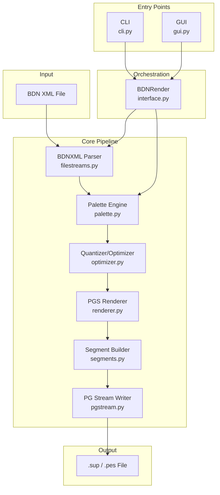

<div align="center">

# OpenSUP

### Professional-Grade PGS Subtitle Encoder for Blu-ray

**Turn BDN XML subtitles into Blu-ray compliant .sup / .pes streams**

<br>

[]()
[]()
[]()
[]()

<br>

</div>

---

- [Overview](#overview)
- [Features](#features)
- [Quick Start](#quick-start)
- [Installation](#installation)
  - [Pre-built Executable (Windows)](#option-1-pre-built-executable-windows-recommended)
  - [Run from Source](#option-2-run-from-source)
  - [Build Your Own Executable](#option-3-build-your-own-executable)
- [Usage](#usage)
  - [Graphical Interface (GUI)](#graphical-interface-gui)
  - [Command Line Interface (CLI)](#command-line-interface-cli)
  - [CLI Options Reference](#cli-options-reference)
- [Architecture](#architecture)
  - [Pipeline Overview](#pipeline-overview)
  - [Quantizer Backends](#quantizer-backends)
- [Project Structure](#project-structure)
- [Configuration](#configuration)
- [Troubleshooting](#troubleshooting)
- [License](#license)
- [Credits](#credits)

---

## Overview

**OpenSUP** is a professional-grade encoder for **PGS** (Presentation Graphic Stream) subtitles — the standard subtitle format for Blu-ray discs. It takes **BDN XML** files (the industry interchange format for subtitling) and produces fully compliant **.sup** or **.pes** streams ready for authoring.

Built as an open-source evolution of [SUPer](https://github.com/cubicibo/SUPer) by cubicibo, OpenSUP combines a modern **CustomTkinter** graphical interface with a powerful **CLI**, supporting multiple quantizer backends and fine-grained control over encoding parameters.

> [!NOTE]
> PGS subtitles are bitmap-based (not text), which means every subtitle is an image. OpenSUP handles the entire pipeline: parsing BDN XML, palette optimization, image compression, and Blu-ray compliant stream muxing.

---

## Features

<div align="center">

| Category | Feature | Description |
|:---------|:--------|:------------|
| **Encoding** | BDN XML → SUP/PES | Full pipeline from source to Blu-ray compliant stream |
| | 4 Quantizer Backends | libimagequant / PNGQ, Pillow, HexTree, QtzrUTC |
| | Compression Control | Fine-tune quality vs. file size (0–100%) |
| | Acquisition Rate | Control intra-refresh period for corrupt-frame recovery |
| **Color** | BT.601 / BT.709 / BT.2020 | Support for standard-def, high-def, and UHD BT matrices |
| | Full Palette Writing | Force full YCbCr+A palette in every PCS segment |
| | SSIM Tolerance | Per-event SSIM-based quality gating |
| **Performance** | Multi-threaded Encoding | Automatic or manual thread count (1–8) |
| | Parallel Event Processing | Multiprocessing worker pool for concurrent encoding |
| | Progress & ETA | Real-time progress bar with estimated time remaining |
| **Modes** | Allow/Prefer Normal Case | Enable or bias toward mixed-case mapping |
| | Overlap Buffering | Allow consecutive subtitle overlaps |
| | Output All Formats | Generate both .sup and .pes/.mui simultaneously |
| | Ignore Resolution | Bypass Blu-ray resolution validation |
| **Interface** | Modern GUI (CustomTkinter) | Windows 11-style UI with light theme, dark accents |
| | Colored Log Output | Level-based coloring with PASS/FAIL highlights |
| | Copy Log | One-click clipboard copy with sanitized output |
| | CLI Mode | Headless batch processing and automation support |
| **Build** | Portable Executable | Single-file .exe for Windows (PyInstaller) |
| | config.ini Support | External configuration file for advanced tuning |

</div>

---

## Quick Start

```bash
# GUI mode
python main.py

# CLI mode — encode BDN XML to SUP
python main.py -i input.xml output.sup
```

---

## Installation

### Option 1: Pre-built Executable (Windows) — Recommended

1. Download the latest `OpenSUP.exe` from the [Releases](https://github.com/Lanzoone30/OpenSUP/releases) page.
2. Place it in your preferred folder alongside the `lib/` and `bin/` directories (included in the release archive).
3. Double-click `OpenSUP.exe` to launch the GUI, or run from the command line:

```batch
OpenSUP.exe -i input.xml output.sup
```

### Option 2: Run from Source

**Prerequisites:** Python 3.11 or later, pip.

```bash
# 1. Clone the repository
git clone https://github.com/Lanzoone30/OpenSUP.git
cd OpenSUP

# 2. (Optional) Create a virtual environment
python -m venv .venv
source .venv/bin/activate   # Linux
.venv\Scripts\activate       # Windows

# 3. Install dependencies
pip install -r requirements.txt

# 4. Launch
python main.py              # GUI
python main.py -i in.xml out.sup  # CLI
```

> [!TIP]
> You can also run via `python -m opensup` thanks to the `__main__.py` entry point.

### Option 3: Build Your Own Executable

The project includes `tools/build_windows.py` for automating Windows builds with PyInstaller.

```bash
# Install build tools
pip install pyinstaller pyinstaller-hooks-contrib

# Run the build script
python tools/build_windows.py

# The executable will be in dist/OpenSUP.exe
```

---

## Usage

### Graphical Interface (GUI)

Launch without arguments to open the main window:

```
python main.py
```

1. **Select BDN XML** — Click the button and choose your input file.
2. **Set Output** — Choose where to save the .sup file.
3. **Configure Parameters** — Adjust compression, quantizer, color space, and toggle options.
4. **Make it SUP!** — Start encoding with real-time progress and colored log output.

<div align="center">

| Parameter | Description | Default |
|:----------|:------------|:--------|
| Compression | Quality factor (higher = better quality, larger file) | 85% |
| Acquisition Rate | Intra-refresh probability (higher = more keyframes) | 100% |
| Color Space | BT.601 / BT.709 / BT.2020 | BT.709 |
| Quantizer | libimagequant (best) / Pillow / HexTree / QtzrUTC | libimagequant |
| Threads | Worker threads (auto or 1–8) | auto |
| Extra Acquisitions | Forced keyframes after N palette updates | 3 |
| Max Bitrate | Bitrate cap in Kbps | 16000 Kbps |

</div>

### Command Line Interface (CLI)

```bash
python main.py -i input.xml [options] output.sup
```

### CLI Options Reference

```
-i, --input      Input BDN XML file (required)
-c, --compression   Compression rate [0-100] (default: 80)
-a, --acqrate       Acquisition rate [0-100] (default: 100)
-q, --quantizer     Quantizer backend:
                    0: QtzrUTC
                    1: Pillow
                    2: HexTree
                    3: PNGQ / libimagequant (default)
-b, --bt            Color matrix: 601, 709, 2020 (default: 709)
-n, --allow-normal  Allow normal (mixed) case mapping
-k, --prefer-normal Prefer normal case mapping
-p, --palette       Write full palette in every PCS
-d, --ahead         Allow overlap buffering
-w, --withsup       Output both .sup and .pes/.mui
-e, --extra-acq     Extra acquisitions after N updates (default: 2)
-m, --max-kbps      Max bitrate in Kbps (default: 0 = unlimited)
-t, --threads       Worker threads (default: 0 = auto)
-y, --yes           Overwrite existing output
--ignore-resolution Bypass Blu-ray resolution validation
-v, --version       Show version and exit
--capabilities      Show codec capabilities and exit
```

**Example — high-quality encode:**

```bash
python main.py -i BDN_Index.xml -c 95 -q 3 -b 709 -t 4 output.sup
```

---

## Architecture

### Pipeline Overview



### Quantizer Backends

OpenSUP supports four quantization engines, each with different trade-offs:

| Backend | Quality | Speed | Description |
|:--------|:--------|:------|:------------|
| **libimagequant / PNGQ** | ★★★★★ | ★★★★☆ | High-quality palette generation via libimagequant (external DLL). Best balance of quality and speed. |
| **HexTree** | ★★★★☆ | ★★★★★ | Fastest option. Uses HexTree color quantization. Ideal for previews or time-sensitive workflows. |
| **Pillow** | ★★★☆☆ | ★★★☆☆ | Reliable fallback using PIL's built-in quantizer. No external dependencies. |
| **QtzrUTC** | ★★★★★ | ★★★☆☆ | Advanced perceptual quantizer (from brule). Best quality but slower. |

The default and recommended quantizer is **libimagequant/PNGQ** (option 3), which provides the best quality-to-speed ratio.

---

## Project Structure

```
OpenSUP/
├── main.py                          # Application entry point (CLI/GUI dispatch)
├── pyproject.toml                   # Project metadata and build config
├── requirements.txt                 # Python dependencies
├── LICENSE                          # GNU General Public License v3
├── opensup.spec / OpenSUP.spec      # PyInstaller spec files
│
├── src/opensup/                     # Main package
│   ├── __init__.py                  # Package exports (version, author)
│   ├── __main__.py                  # `python -m opensup` entry point
│   ├── __metadata__.py             # Single source of truth for version info
│   ├── cli.py                       # Command-line interface (argparse)
│   ├── gui.py                       # CustomTkinter graphical interface
│   ├── config.py                    # config.ini loader
│   │
│   ├── core/                        # Encoding pipeline
│   │   ├── interface.py             # BDNRender orchestrator
│   │   ├── filestreams.py           # BDN XML parser
│   │   ├── renderer.py              # PCS segment rendering
│   │   └── segments.py             # Segment construction
│   │
│   ├── media/                       # Image processing
│   │   ├── optimizer.py             # Quantizer wrapper
│   │   ├── palette.py               # Palette generation & manipulation
│   │   ├── pgraphics.py             # PGS graphics objects
│   │   └── pgstream.py              # PG stream writer
│   │
│   ├── utils/                       # Utilities & helpers
│   │   ├── logging.py               # LogFacility, tqdm integration
│   │   ├── bdvideo.py               # Blu-ray video utilities
│   │   ├── color_matrix.py          # YCbCr conversion matrices
│   │   ├── geometry.py              # Coordinate & scaling helpers
│   │   ├── ssim.py                  # SSIM-based quality comparison
│   │   └── timecode.py              # Timecode parsing & arithmetic
│   │
│   ├── lib/                         # External shared libraries
│   │   └── libimagequant_x86_64.dll
│   │
│   └── bin/                         # External binaries
│       └── pngquant.exe
│
├── tools/                           # Development & build tools
│   ├── build_windows.py             # Automated PyInstaller build
│   ├── OpenSUP.bat                  # Windows launcher
│   ├── opensup.sh                   # Linux launcher
│   ├── run_cli.bat                  # CLI quick-launch (Windows)
│   └── run_gui.bat                  # GUI quick-launch (Windows)
│
├── tests/                           # Test suite
│   ├── fixtures/                    # Test BDN XML samples
│   ├── test_quantizers.py           # Unit tests for quantizers
│   └── test_integration_quantizers.py  # Integration tests
│
├── assets/                          # Application assets
│   └── OpenSup.ico                  # Application icon
│
└── .opencode/                       # OpenCode development config
```

---

## Configuration

OpenSUP supports an optional `config.ini` file placed alongside the executable or in the project root. This allows persistent tuning without modifying source code.

### `config.ini` sections

**`[SUPer]`** — General encoding options:
```ini
[SUPer]
abort_on_error = 0   ; Exit on first encoding error (1 = yes, 0 = no)
```

**`[PILIQ]`** — libimagequant/PNGQ quantizer tuning:
```ini
[PILIQ]
quantizer = bin/pngquant.exe   ; Path to pngquant executable
max_colors = 256                ; Maximum palette colors
speed = 3                       ; Speed/quality trade-off (1 = slowest/best, 10 = fastest)
```

---

## Troubleshooting

> [!WARNING]
> **Build errors on Windows?** Make sure `lib/` and `bin/` are in the same directory as the executable. The app resolves these paths relative to `sys.argv[0]`.

> [!TIP]
> **Slow startup in frozen mode?** The first launch may be slower due to dependency loading. Lazy imports in the GUI reduce startup time to ~3–5 seconds.

> [!CAUTION]
> **PGS subtitles are resolution-dependent.** By default, OpenSUP validates against Blu-ray resolutions (1920×1080, 1280×720). Use `--ignore-resolution` or the checkbox toggle to bypass this check for non-standard resolutions.

<details>
<summary><b>Common CLI Errors</b></summary>

| Error | Likely Cause | Solution |
|:------|:-------------|:--------|
| `config.ini not found!` | Missing config file | Create one or suppress with `-y` flag |
| `Output file already exists` | File exists without `-y` | Add `-y` to overwrite |
| `Not a known PG stream extension` | Output must be `.sup` or `.pes` | Use `.sup` extension |
| `Unknown quantization mode` | Invalid `-q` value | Use 0–3 |

</details>

---

## License

**OpenSUP** is free software: you can redistribute it and/or modify it under the terms of the **GNU General Public License** as published by the Free Software Foundation, either version 3 of the License, or (at your option) any later version.

This program is distributed in the hope that it will be useful, but **without any warranty**; without even the implied warranty of merchantability or fitness for a particular purpose. See the [LICENSE](LICENSE) file for details.

---

## Credits

- **cubicibo** — Original author of [SUPer](https://github.com/cubicibo/SUPer), the foundation of OpenSUP.
- **Adrian A. Vargas Lanzone** — OpenSUP fork, GUI redesign, Windows build tooling, and ongoing maintenance.
- **Contributors** — See [GitHub Contributors](https://github.com/Lanzoone30/OpenSUP/graphs/contributors) for the full list.

---

<div align="center">

**OpenSUP v1.0.0** — *Professional PGS subtitle encoding, free for everyone.*

</div>
