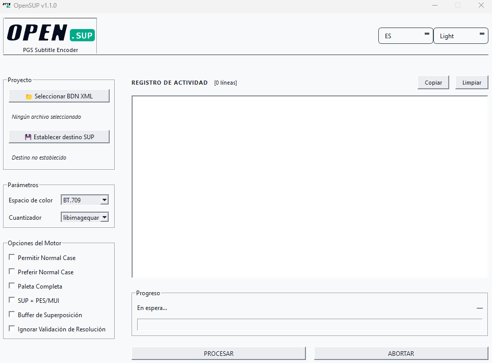

### PGS Subtitle Encoder

**Turn BDN XML subtitles into Blu-ray compliant .sup / .pes streams**

<br>

[]()
[]()
[]()

<br>

---

## Overview

OpenSUP converts **BDN XML** subtitle files — images included — into **PGS** (Presentation Graphic Stream) subtitles for Blu-ray. It produces compliant **.sup** streams, and **.pes/.mui** when needed.

The engine handles the whole process in a single run: parsing the XML, loading the embedded images, quantizing colors, and assembling the final stream. A bilingual GUI and a full-featured CLI share the same pipeline.

Rewritten from [SUPer](https://github.com/cubicibo/SUPer) by cubicibo, Python to C++17.

---

## Features

- **Blu-ray ready** — converts BDN XML subtitles, images included, into compliant .sup streams
- **Two output formats** — .sup and .pes/.mui, or both in a single run
- **Quality or speed** — two quantization engines: maximum quality or faster encoding
- **Color accuracy** — BT.709 / BT.601 / BT.2020 color space presets
- **Easy to use** — pick your subtitle file, choose a destination, press ENCODE
- **Dark / Light / System themes** — match your preference
- **English and Spanish** — switch languages at any time
- **Activity log** — see every step with color-coded results; copy or clear it
- **Command line support** — for scripting and batch jobs

---

## Screenshot

<div align="center">
  
  <p><em>OpenSUP GUI — Light theme</em></p>
</div>

---

## Download

Windows builds are available on the [Releases](https://github.com/Lanzoone30/OpenSUP/releases) page:

- **ZIP** — extract and run `OpenSUP.exe`

---

## GUI Reference

### File Selection

| Control        | Function                                                                 |
| -------------- | ------------------------------------------------------------------------ |
| **Select BDN** | Load a BDN XML file                                                      |
| **Set Output** | Choose the destination path; `.sup` is appended automatically if missing |

### Parameters

| Control         | Options                   | Function                                                           |
| --------------- | ------------------------- | ------------------------------------------------------------------ |
| **Color Space** | BT.709 / BT.601 / BT.2020 | Color matrix for YCbCr conversion                                  |
| **Quantizer**   | libimagequant / HexTree   | Quantization backend: libimagequant for quality, HexTree for speed |

### Engine Options

| Checkbox                         | Function                                                                                                                                                                                                                                                                                               |
| -------------------------------- | ------------------------------------------------------------------------------------------------------------------------------------------------------------------------------------------------------------------------------------------------------------------------------------------------------ |
| **Allow Normal Case**            | Updates only one of the two PGS composition objects when there is not enough time to update both. Exploits the PG object buffer. Stream shall NOT be Built or Rebuilt at the authoring stage.                                                                                                          |
| **Prefer Normal Case**           | Updates only one of the two compositions even when decode time is sufficient to refresh both. Can reduce the bitrate, but the palette is not shared across composition objects when it occurs. Checking it forces **Allow Normal Case** on and locks it.                                               |
| **Write Full Palette**           | Uses the full 256-entry palette instead of an optimized subset when there are too many colors. May improve quality in rare cases at the cost of a larger output.                                                                                                                                       |
| **Both SUP + PES/MUI**           | Also exports a .pes/.mui file alongside the .sup file in a single run.                                                                                                                                                                                                                                 |
| **Overlap Buffering**            | Allows generating overlapping objects in the output stream. More efficient, but not well supported by some hardware decoders.                                                                                                                                                                          |
| **Ignore Resolution Validation** | By default, encoding fails if the video resolution is not one of the standard Blu-ray resolutions (1920×1080, 1280×720, 720×576, 720×480). Enable to ignore Blu-ray standards and encode anyway. **Use at your own risk** — the resulting stream may not be Blu-ray compliant or may play incorrectly. |

### Theme & Language

| Setting      | Options               |
| ------------ | --------------------- |
| **Theme**    | System / Light / Dark |
| **Language** | English / Spanish     |

---

## CLI Reference

```bash
./opensup_cli input.xml output.sup -b bt709 -y
```

| Flag                  | Description                                           |
| --------------------- | ----------------------------------------------------- |
| `-i, --input`         | BDN XML input file (required)                         |
| `output`              | Output .sup file path (positional, required)          |
| `-c, --compression`   | Compression rate [0-100] (default 80)                 |
| `-a, --acqrate`       | Acquisition rate [0-100] (default 100)                |
| `-q, --quantizer`     | Quantizer: 0 = libimagequant, 1 = HexTree (default 0) |
| `-b, --bt`            | Color matrix: bt601, bt709, bt2020 (default bt709)    |
| `-y, --yes`           | Overwrite existing output                             |
| `-t, --threads`       | Thread count (0 = auto)                               |
| `--ssim-tol`          | SSIM tolerance [0-100] (default 0)                    |
| `--ignore-resolution` | Accept non-standard video resolutions                 |
| `-w, --withsup`       | Generate both .sup and .pes/.mui                      |
| `-p, --palette`       | Write full 256-entry palette                          |
| `--allow-normal`      | Enable normal-case optimization                       |
| `--overlap`           | Enable overlap buffering                              |
| `--redraw-period`     | Redraw period in seconds                              |
| `-v, --version`       | Print version and exit                                |

> **Note:** `-c`, `-a` and `-t` are parsed but not yet wired to the encode pipeline (stubs).

**Exit codes:** `0` on success, `1` on failure (parse error, output exists without `-y`, encode failure).

---

## Project Structure

```
src/opensup/
├── common/             Shared utilities
│   ├── bdvideo         Blu-ray video formats and frame rates
│   ├── color_matrix    BT.601 / BT.709 / BT.2020 YCbCr conversion
│   ├── error           Exception hierarchy
│   ├── geometry        Box and window helpers
│   ├── logger          Logging facility
│   ├── memory          Memory helpers
│   ├── ssim            SSIM comparison
│   └── timecode        Timecode / PTS helpers
├── media/              PGS media layer
│   ├── hextree_impl    HexTree quantizer core (ported from brule, MIT)
│   ├── palette         Palette and palette-entry handling
│   ├── pgraphics       PGS graphics (RLE encode/decode, object buffer)
│   ├── pgstream        PGS stream timing and buffering
│   └── optimizer       Quantization backends (libimagequant / HexTree)
├── core/               Core engine
│   ├── filestreams     BDN XML parser, .sup / .pes writers
│   ├── renderer        Epoch encoder (diff, crop, quantize, assemble)
│   ├── segments        PGS segment types (PCS, WDS, PDS, ODS, ENDS)
│   └── interface       Encode pipeline orchestration (bdn_render_c)
├── cli/                CLI entry point (CLI11)
├── gui/                Qt6 GUI (main window, worker, log handler, theme, translations)
└── pch.h               Precompiled header
```

---

## License

GPL v3 — see [LICENSE](LICENSE).
Copyright (C) 2024-2026 Lanzoone30. Based on [SUPer](https://github.com/cubicibo/SUPer) by cubicibo.

---

## Credits

- **[SUPer](https://github.com/cubicibo/SUPer)** — original Python implementation by cubicibo; design adapted into OpenSUP
