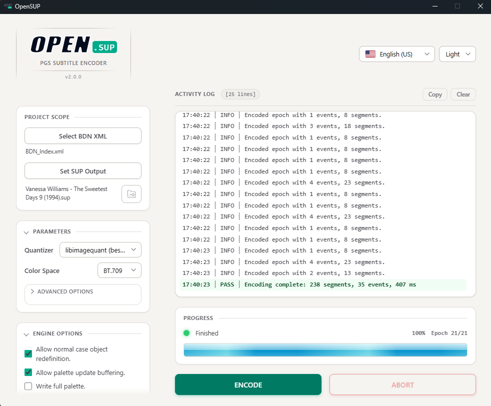

### PGS Subtitle Encoder

**Turn BDN XML subtitles into Blu-ray compliant .sup / .pes streams**

[](https://github.com/Lanzoone30/OpenSUP/releases)
[](LICENSE)
[](https://github.com/Lanzoone30/OpenSUP/releases)

---

## Table of Contents

- [Overview](#overview)
- [Features](#features)
- [Screenshot](#screenshot)
- [Download](#download)
- [Quick Start](#quick-start)
- [GUI Reference](#gui-reference)
- [CLI Reference](#cli-reference)
- [Architecture](#architecture)
- [Project Structure](#project-structure)
- [Troubleshooting](#troubleshooting)
- [Technical notes](#technical-notes)
- [License](#license)
- [Credits](#credits)

---

## Overview

OpenSUP converts **BDN XML** subtitle files, images included, into **PGS** (Presentation Graphic
Stream) subtitles for Blu-ray. It produces compliant **.sup** streams, and **.pes/.mui** when
needed.

The engine handles the whole process in a single run: parsing the XML, loading the embedded images,
quantizing colors, and assembling the final stream. A bilingual GUI and a full-featured CLI share
the same pipeline.

The encoder core is **C++17**, rewritten from [SUPer](https://github.com/cubicibo/SUPer) by
cubicibo. The desktop app is **Go + Wails v2** with a vanilla HTML/CSS/JS frontend that drives the
embedded engine.

---

## Features

- **Blu-ray ready**: converts BDN XML subtitles, images included, into compliant .sup streams
- **Two output formats**: .sup and .pes/.mui, or both in a single run
- **Quality or speed**: two quantization engines, one tuned for maximum quality and one for faster
  encoding
- **Color accuracy**: BT.709 / BT.601 / BT.2020 color space presets
- **Bitrate control**: validate the output against a maximum bitrate and tune quality/speed
  trade-offs
- **Activity log**: see every step with color-coded results; copy or clear it
- **Command line support**: for scripting and batch jobs, with NDJSON output for automation

---

## Screenshot

<div align="center">
  <picture>
    <source media="(prefers-color-scheme: dark)" srcset="assets/images-preview/GUI-Preview_dark.png">
    <source media="(prefers-color-scheme: light)" srcset="assets/images-preview/GUI-Preview_light.png">
    
  </picture>
  <p><em>OpenSUP GUI</em></p>
</div>

---

## Download

Prebuilt builds are available on the
[Releases](https://github.com/Lanzoone30/OpenSUP/releases) page.

**Windows** (x86_64)

- **ZIP**: extract and run `OpenSUP.exe`

**Linux** (x86_64)

- **RPM**: `sudo dnf install ./opensup-2.0.0-1.x86_64.rpm`
- **DEB**: `sudo apt install ./opensup_2.0.0_amd64.deb`

Both Linux packages register OpenSUP in your application menu. They require
`webkit2gtk 4.1` and `GTK 3`, installed automatically as dependencies.

---

## Quick Start

1. **Select BDN XML**: load the subtitle file (images included).
2. **Set SUP Output**: choose where the `.sup` will be written.
3. **Tune parameters**: pick a quantizer and color space; adjust advanced options if needed.
4. **Press ENCODE**: follow progress and the activity log, or ABORT at any time.

A BDN XML file can also be dragged and dropped onto the left panel.

---

## GUI Reference

### File Selection

| Control            | Function                                                                 |
| ------------------ | ------------------------------------------------------------------------ |
| **Select BDN**     | Load a BDN XML file                                                      |
| **Set SUP Output** | Choose the destination path; `.sup` is appended automatically if missing |

### Parameters

| Control         | Options                   | Function                                                           |
| --------------- | ------------------------- | ------------------------------------------------------------------ |
| **Quantizer**   | libimagequant / HexTree   | Quantization backend: libimagequant for quality, HexTree for speed |
| **Color Space** | BT.709 / BT.601 / BT.2020 | Color matrix for YCbCr conversion                                  |

<details open>
<summary><strong>Advanced options</strong></summary>

| Control             | Range         | Default | Function                                                                                                |
| ------------------- | ------------- | ------- | ------------------------------------------------------------------------------------------------------- |
| **Threads**         | Auto / 1.._N_ | Auto    | Parallel epoch encoding workers. _N_ is the number of detected physical cores; 0 = Auto, 1 = sequential |
| **Anchor interval** | ≥ 0 s         | 0       | Anchor a redraw every N seconds (0 = disable)                                                           |
| **Max bitrate**     | 0..48000 Kbps | 0       | Validate the output against a maximum bitrate (0 = off)                                                 |
| **Compression**     | 0..100        | 80      | Compression/quality factor (0 = force all acquisitions)                                                 |
| **Acq. Rate**       | 0..100        | 100     | Acquisition rate / drought scaling                                                                      |
| **SSIM Tol.**       | -100..100     | 0       | SSIM tolerance, adjusted per resolution                                                                 |
| **Extra Acq**       | 0..100        | 2       | Insert an acquisition after N palette updates (0 = off)                                                 |

</details>

### Engine Options

<details open>
<summary><strong>Output and authoring flags</strong></summary>

| Checkbox                         | Function                                                                                                                                                                                          |
| -------------------------------- | ------------------------------------------------------------------------------------------------------------------------------------------------------------------------------------------------- |
| **Allow Normal Case**            | Updates only one of the two PGS composition objects when there is not enough time to update both. Exploits the PG object buffer. The stream shall NOT be Built or Rebuilt at the authoring stage. |
| **Write Full Palette**           | Writes the full 256-entry palette for every epoch instead of an optimized subset. Can improve quality at the cost of a larger output.                                                             |
| **Both SUP + PES/MUI**           | Also exports a .pes/.mui file alongside the .sup file in a single run.                                                                                                                            |
| **Overlap Buffering**            | Allows generating overlapping objects in the output stream. More efficient, but not well supported by some hardware decoders.                                                                     |
| **Alternate OIDs**               | Alternates per-window object ids (double buffering). Useful for multi-window compositions.                                                                                                        |
| **Ignore Resolution Validation** | By default, encoding fails if the video resolution is not one of the standard Blu-ray resolutions (1920×1080, 1280×720, 720×576, 720×480). Enable to ignore Blu-ray standards and encode anyway.  |

</details>

> [!WARNING]
> The **Ignore Resolution Validation** option skips checks for Blu-ray format compliance. Some
> events may not play correctly. Use with caution.

### Theme & Language

| Setting      | Options               |
| ------------ | --------------------- |
| **Theme**    | System / Light / Dark |
| **Language** | English / Spanish     |

---

## CLI Reference

The CLI shares the exact same engine as the GUI.

```bash
./opensup_cli -i input.xml output.sup -b bt709 -y
```

| Flag                  | Description                                                           |
| --------------------- | --------------------------------------------------------------------- |
| `-i, --input`         | BDN XML input file (required)                                         |
| `output`              | Output .sup file path (positional, required)                          |
| `-q, --quantizer`     | Quantizer: 0 = libimagequant, 1 = HexTree (default 0)                 |
| `-b, --bt`            | Color space: bt601, bt709, bt2020 (default bt709)                     |
| `-y, --yes`           | Overwrite existing output                                             |
| `-w, --withsup`       | Generate both .sup and .pes/.mui                                      |
| `-p, --palette`       | Write full palette for all epochs                                     |
| `--allow-normal`      | Allow normal-case object redefinition                                 |
| `--overlap`           | Allow palette update buffering                                        |
| `--alternate-oids`    | Alternate per-window object ids (multi-window)                        |
| `--ignore-resolution` | Accept non-standard video resolutions (experimental)                  |
| `--redraw-period`     | Anchor interval in seconds (0 = disable, minimum 1)                   |
| `-m, --max-kbps`      | Validate against a max bitrate in Kbps [0-48000, 0 = off] (default 0) |
| `-j, --threads`       | Parallel epoch workers [0 = auto, 1 = sequential] (default 0)         |
| `-c, --compression`   | Compression/quality factor [0-100] (default 80)                       |
| `-a, --acqrate`       | Acquisition rate [0-100] (default 100)                                |
| `-t, --ssim-tol`      | SSIM tolerance [-100..100] (default 0)                                |
| `-e, --extra-acq`     | Insert acquisition after N palette updates [0 = off] (default 2)      |
| `--json`              | Emit NDJSON events to stdout (log / progress / done)                  |
| `-d, --debug`         | Enable debug logging                                                  |
| `-v, --version`       | Print version and exit                                                |

**Exit codes:** `0` on success, `1` on failure (parse error, output exists without `-y`, encode
failure).

---

## Architecture

The Go runtime spawns the C++ engine as a child process and talks to it over **NDJSON** on stdio, so
the GUI never links the encoder directly.



The Wails v2 desktop app hosts the frontend and the Go binding layer; the engine runner spawns
`opensup_cli`, whose orchestrator (`bdn_render_c`) parses the BDN XML, splits it into epochs encoded
in parallel, and assembles the PGS segments written as `.sup` / `.pes` / `.mui`.

---

## Project Structure

```text
.
├── src/opensup/          C++17 engine
│   ├── common/           Shared utilities
│   │   ├── bdvideo       Blu-ray video formats and frame rates
│   │   ├── color_matrix  BT.601 / BT.709 / BT.2020 YCbCr conversion
│   │   ├── error         Exception hierarchy
│   │   ├── geometry      Point / shape / box helpers
│   │   ├── logger        Logging facility
│   │   ├── memory        Reference-counted byte buffers
│   │   ├── ssim          SSIM comparison
│   │   └── timecode      Timecode / PTS helpers
│   ├── media/            PGS media layer
│   │   ├── hextree_impl  HexTree quantizer core (ported from brule, MIT)
│   │   ├── optimizer     Quantization backends (libimagequant / HexTree)
│   │   ├── palette       Palette and palette-entry handling
│   │   └── pgraphics     PGS graphics (RLE encode/decode, object buffer)
│   ├── core/             Core engine
│   │   ├── ctu           Recursive area-weighted SSIM comparison
│   │   ├── filestreams   BDN XML parser, .sup / .pes writers
│   │   ├── interface     Encode pipeline orchestration (bdn_render_c)
│   │   ├── layout_engine Window split layout (1 or 2 windows)
│   │   ├── pgstream      Bitrate / decoder buffer model (leaky bucket)
│   │   ├── renderer      Epoch encoder (compose, quantize, palette, reuse)
│   │   └── segments      PGS segment types (PCS, WDS, PDS, ODS, ENDS)
│   └── cli/              CLI entry point (CLI11) + NDJSON emitter
├── ui/                   Wails v2 desktop app
│   ├── app.go            Go binding layer
│   ├── config/           Settings persistence + physical-core detection
│   ├── engine/           Engine runner and embedded per-OS binaries
│   ├── i18n/             English / Spanish strings
│   └── frontend/         Vanilla HTML/CSS/JS frontend (Vite)
├── cmake/                Toolchains and version header template
└── CMakeLists.txt        Build entry point
```

---

## Troubleshooting

- **Encoding fails on an unusual resolution**: only standard Blu-ray resolutions are accepted by
  default. Enable **Ignore Resolution Validation** (`--ignore-resolution`) to override, accepting
  the compliance risk.
- **Some hardware decoders reject the stream**: disable **Overlap Buffering** (`--overlap`); overlap
  is more efficient but not universally supported.
- **Parallel output differs from sequential**: it should not. `-j N` is verified to produce
  byte-identical output to `-j 1`; if you observe otherwise, please report it.

---

## Technical notes

- **Determinism**: multithreaded encoding (`-j N`) is byte-identical to sequential (`-j 1`).
- **Parity**: the generated `.sup` structure matches the original SUPer output; the CLI is verified
  against a SubtitleEdit reference stream.
- **Compactness**: output was measured smaller than the SubtitleEdit reference on the test corpus
  used during development.

---

## License

GPL v3, see [LICENSE](LICENSE).
Copyright (C) 2026 Lanzoone30. Based on [SUPer](https://github.com/cubicibo/SUPer) by cubicibo.

---

## Credits

- **[SUPer](https://github.com/cubicibo/SUPer)**: original Python implementation by cubicibo; design
  adapted into OpenSUP
- **[libimagequant](https://github.com/ImageOptim/libimagequant)**: high-quality palette
  quantization
- **[brule](https://github.com/cubicibo/brule)**: HexTree quantizer and layout engine core (MIT)
- **[CLI11](https://github.com/CLIUtils/CLI11)** and **[pugixml](https://github.com/zeux/pugixml)**:
  CLI parsing and XML
- **[Wails](https://wails.io)**: Go desktop application framework
